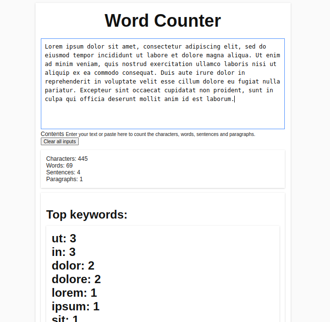

**Getting started:-**

We start off by creating a folder named **jQuery Word Counter**. We open this folder in an editor. I am using Atom for it. Having done that, we will create a file named ‘index.html’ which will be storing the Html structure of our web page.

**Creating index.html file:-**

We give our web page the title **“jQuery Word Counter”**. We include css in our project with the following code:-

`<link rel="stylesheet" href="css/style.css">`

We also include jQuery in our project with the following code:-

`<script src="js/jquery-3.6.0.js"></script>`

and we include custom jQuery code in our project with the following code:-

`<script src="js/custom.js"></script>`

**index.html file**

```
<!DOCTYPE html>
<html>
    <head>
        <title>
             jQuery Word Counter
        </title>
        <link href="css/style.css" rel="stylesheet">
        </link>
    </head>
    <body>
        <div class="section-full">
            <div class="container">
                <div class="ui-input-container">
                    <h1>
                        jQuery Word Counter
                    </h1>
                    <label class="ui-form-input-container">
                        <textarea class="ui-form-input" id="text-input" placeholder="Enter your text here..."></textarea>
                        <div class="clipboard icon fa fa-copy" id="copyToClipboard-a" title="Copy to clipboard">
                        </div>
                        <span class="form-input-label">
                            Contents
                        </span>
                        <small>
                            Enter your text or paste here to count the characters, words, sentences and paragraphs.
                        </small>
                    </label>
                    <div class="clear-inputs">
                        <button class="clear-all" onclick="javascript:eraseText();">
                            Clear all inputs
                        </button>
                    </div>
                    <div class="container">
                        <div class="row">
                            <div class="out-wrapper">
                                <div class="output">
                                    <div>
                                        Characters:
                                        <span id="characterCount">
                                            0
                                        </span>
                                    </div>
                                </div>
                            </div>
                            <div class="out-wrapper">
                                <div class="output">
                                    <div>
                                        Words:
                                        <span id="wordCount">
                                            0
                                        </span>
                                    </div>
                                </div>
                            </div>
                            <div class="out-wrapper">
                                <div class="output">
                                    <div>
                                        Sentences:
                                        <span id="sentenceCount">
                                            0
                                        </span>
                                    </div>
                                </div>
                            </div>
                            <div class="out-wrapper">
                                <div class="output">
                                    <div>
                                        Paragraphs:
                                        <span id="paragraphCount">
                                            0
                                        </span>
                                    </div>
                                </div>
                            </div>
                        </div>
                    </div>
                    <div class="container">
                        <div class="keywords">
                            Top keywords:
                            <div class="container">
                                <div class="row" id="topKeywords">
                                </div>
                            </div>
                        </div>
                    </div>
                </div>
            </div>
        </div>
        <script src="js/jquery-3.6.0.js">
        </script>
        <script src="js/custom.js">
        </script>
    </body>
</html>
```

**style.css file**

```
/* border box */

html {
  box-sizing: border-box;
  -webkit-user-select: none;
  /* Chrome all / Safari all */
  -moz-user-select: none;
  /* Firefox all */
  -ms-user-select: none;
  /* IE 10+ */
  user-select: none;
  /* Likely future */
}

*,
*:before,
*:after {
  box-sizing: inherit;
}

b {
  font-weight: bold;
}


/* main app styles */

body {
  width: 700px;
  margin: 0 auto;
  background-color: #FAFAFA;
  font-family: 'Source Sans Pro', sans-serif;
  color: #111;
}

.container {
  margin: 2% auto;
  padding: 15px;
  background-color: #FFFFFF;
  -webkit-box-shadow: 0px 1px 4px 0px rgba(0, 0, 0, 0.2);
  box-shadow: 0px 1px 4px 0px rgba(0, 0, 0, 0.2);
}

h1 {
  font-size: 3rem;
  font-weight: 900;
  text-align: center;
  margin: 1% 0 3%;
}

textarea {
  width: 100%;
  height: 250px;
  padding: 10px;
  border: 1px solid #d9d9d9;
  outline: none;
  font-size: 1rem;
  resize: none;
  line-height: 1.5rem;
}

textarea:hover {
  border-color: #C0C0C0;
}

textarea:focus {
  border-color: #4D90FE;
}

.output.row {
  width: 100%;
  border: 1px solid #DDD;
  font-size: 1.4rem;
  margin: 1% 0;
  background-color: #F9F9F9;
}

.output.row div {
  display: inline-block;
  width: 42%;
  padding: 10px 15px;
  margin: 1%;
}

.output.row span {
  font-weight: bold;
  font-size: 1.5rem;
}

#readability {
  width: 52%;
  font-weight: bold;
}

#readability:hover {
  background-color: #4D90FE;
  color: #FFF;
  border-radius: 2px;
  cursor: pointer;
}

#readability:active {
  background-color: #307AF3;
}

.keywords {
  display: none;
  margin: 4% 0 0;
  font-size: 2rem;
  font-weight: 900;
}

.keywords ul {
  font-weight: 400;
  border: 1px solid #DDD;
  font-size: 1.4rem;
  background-color: #F9F9F9;
  margin: 2% 0;
}

.keywords li {
  display: inline-block;
  width: 44%;
  padding: 10px;
  margin: 1%;
}


```

**custom.js file:-**
```
"use strict";

// define element variables
var input = jQuery('#text-input'),
    characterCount = jQuery('#characterCount'),
    wordCount = jQuery('#wordCount'),
    sentenceCount = jQuery('#sentenceCount'),
    paragraphCount = jQuery('#paragraphCount'),
    readingTime = jQuery('#readingTime'),
    keywordsDiv = jQuery('.keywords'),
    topKeywords = jQuery('#topKeywords');

// trigger keyup and change event
input.on("keyup change", function(e) {
    // count the charater length
    characterCount.html(jQuery(this).val().length);
    var words = jQuery(this).val().match(/\b[-?(\w+)?]+\b/gi);

    // check if word count is not empty
    if (words) {
        wordCount.html(words.length);
    } else {
        wordCount.html(0);
    }

    // check if word count is not empty
    if (words) {
        var sentences = jQuery(this).val().split(/[.|!|?]+/g);
        sentenceCount.html(sentences.length - 1);
    } else {
        sentenceCount.html(0);
    }

    // check if word count is not empty
    if (words) {
        var paragraphs = jQuery(this).val().replace(/\n$/gm, '').split(/\n/);
        paragraphCount.html(paragraphs.length);
    } else {
        paragraphCount.html(0);
    }

    // check if word count is not empty
    if (words) {
        var allKeywords = [];
        for (var i = 0; i < words.length; i++) {
            allKeywords.push(words[i].toLowerCase());
        }
        var keywords = {};
        for (var i = 0; i < allKeywords.length; i++) {
            if (allKeywords[i] in keywords) {
                keywords[allKeywords[i]] += 1;
            } else {
                keywords[allKeywords[i]] = 1;
            }
        }
        var sortedKeywords = [];
        for (var keyword in keywords) {
            sortedKeywords.push([keyword, keywords[keyword]])
        }
        sortedKeywords.sort(function(a, b) {
            return b[1] - a[1]
        });
        topKeywords.html('');
        for (var i = 0; i < sortedKeywords.length && i < words.length; i++) {
            var li = document.createElement("div");
            li.className = "col";
            li.innerHTML = sortedKeywords[i][0] + ": " + sortedKeywords[i][1];
            topKeywords.append(li);
        }
    }

    // check if word count is not empty
    if (words) {
        keywordsDiv.show();
    } else {
        keywordsDiv.hide();
    }
});

// Clear the text input
function eraseText() {
    document.getElementById("text-input").value = "";
}


```

# Output



***